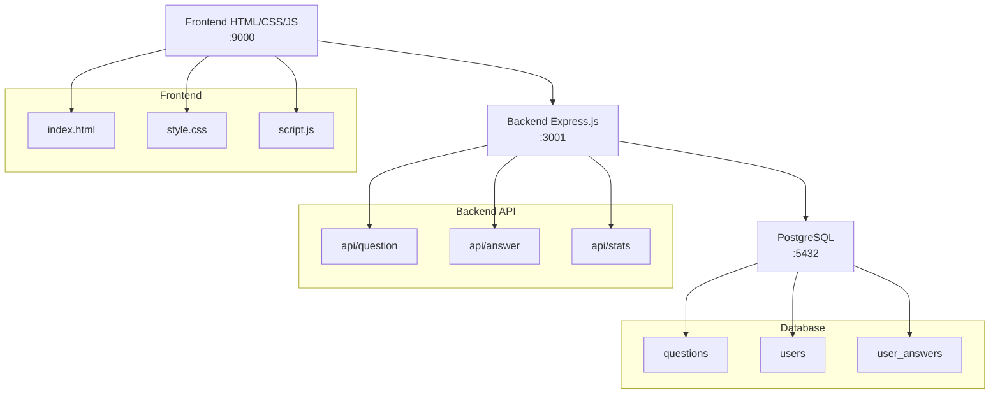
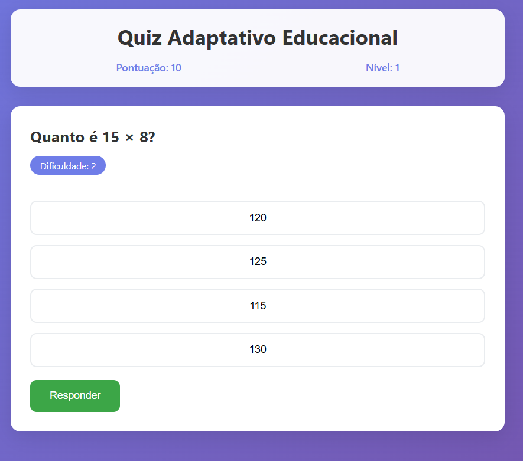
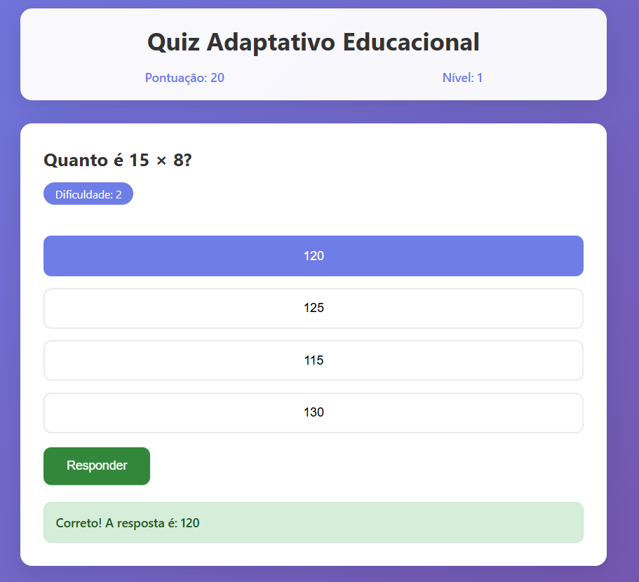
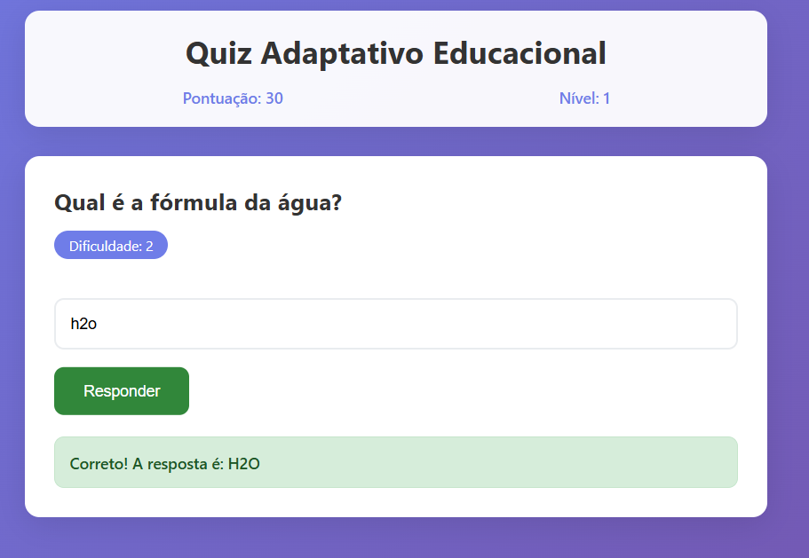
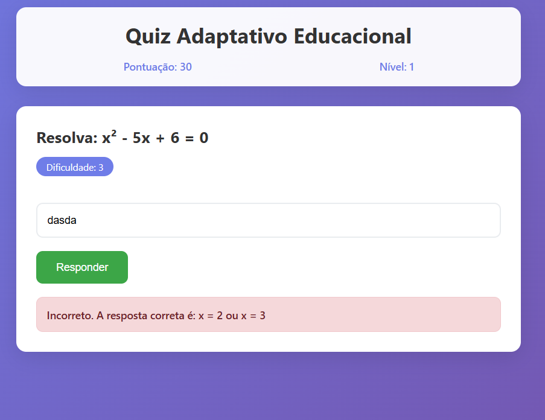

# Quiz Adaptativo Educacional

**Tag:** q-developer-quest-tdc-2025

## 📚 Sobre o Projeto

Sistema de quiz inteligente que personaliza a experiência de aprendizado baseado no desempenho do usuário em tempo real.

## 🎯 Problema que Resolve

- **Aprendizado Ineficiente**: Quizzes tradicionais não se adaptam ao nível do usuário
- **Desmotivação**: Perguntas muito fáceis ou difíceis prejudicam o engajamento
- **Falta de Progressão**: Ausência de feedback personalizado sobre evolução

## ⚡ Capacidades

- **🧠 Adaptação Inteligente**: Ajusta dificuldade baseado nas respostas
- **📊 Feedback Imediato**: Mostra resposta correta e explicação
- **🎮 Progressão Gamificada**: Sistema de pontuação e níveis
- **📱 Interface Responsiva**: Funciona em desktop e mobile
- **🔄 Perguntas Únicas**: Evita repetição de questões já respondidas
- **📈 Estatísticas**: Acompanha precisão e evolução do usuário

## 🛠️ Tecnologias

- **Frontend**: HTML5, CSS3, JavaScript (Vanilla)
- **Backend**: Node.js, Express.js, PostgreSQL
- **Deploy**: AWS (S3, CloudFront, ECS, RDS)
- **Testes**: Jest, Supertest (67% cobertura)

## Como executar

### 1. Banco de Dados (PostgreSQL)
```bash
docker-compose up -d
```

### 2. Backend
```bash
cd backend
npm install
npm run dev
```

### 3. Frontend
```bash
cd frontend
python3 -m http.server 9000
```

## Testes

### Backend
```bash
cd backend
npm test
```

**Cobertura:** 67% (10 testes)
- ✅ Question Model (100% funções)
- ✅ QuizController (69% statements) 
- ✅ API Endpoints (todos cenários)
- ✅ Testes de sucesso e erro

## Arquitetura



- **Frontend**: HTML/CSS/JS (porta 9000)
- **Backend**: Express.js MVC (porta 3001)
- **Database**: PostgreSQL (porta 5432)

## API Endpoints
- `GET /api/question?level=X` - Buscar pergunta por nível
- `POST /api/answer` - Enviar resposta
- `GET /api/stats` - Estatísticas do usuário

## Deploy AWS

### Usando AWS CDK
```bash
cd infrastructure
npm install
cdk bootstrap
cdk deploy
```

**Infraestrutura:**
- Frontend: S3 + CloudFront
- Backend: ECS Fargate + ALB
- Database: RDS PostgreSQL
- Network: VPC com 2 AZs

**Custo estimado:** ~$77/mês


**Imagens de exemplo:**




